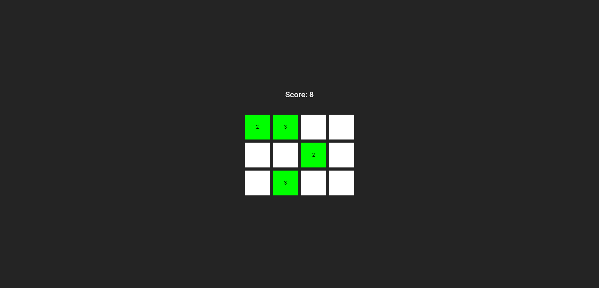

# Memory Match Game

Live website: https://fatihbulbul1.github.io/react-memory-match-game/

# Overview

Made by:

- **React**
- TypeScript

## Description

- This is a memory game made by React TypeScript.
- Grid is randomly generated every time.
- Project created with Vite.

### Author

- LinkedIn - [Ömer Fatih Bülbül](https://www.linkedin.com/in/ömer-fatih-bülbül-74a890236/)
- Twitter - [fatihbulbul91](https://twitter.com/fatihbulbul91)
